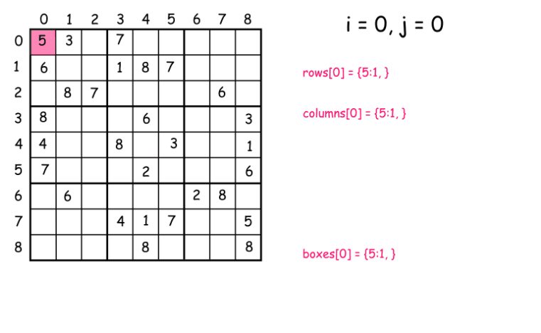
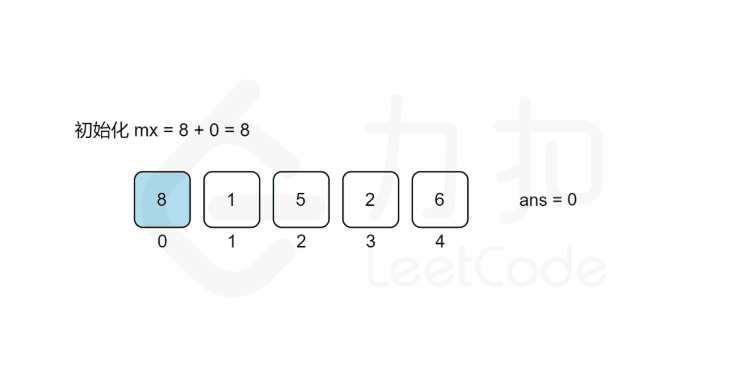
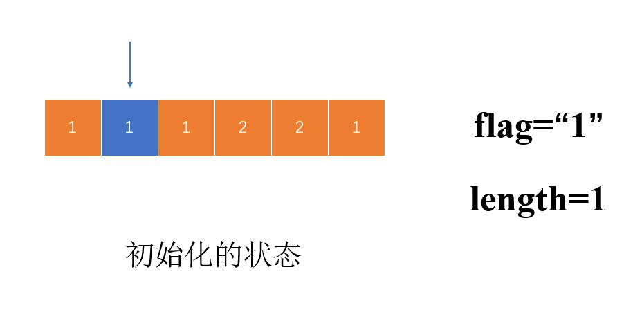
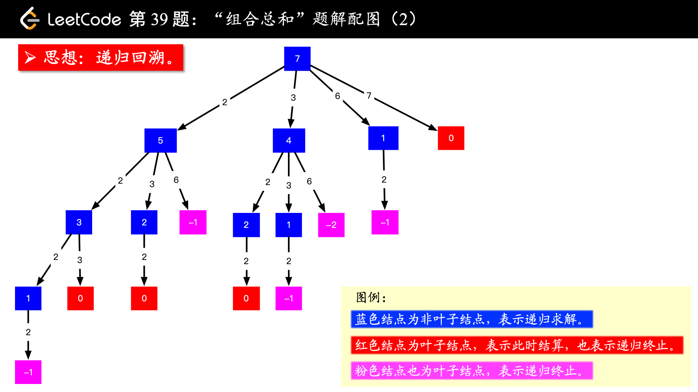
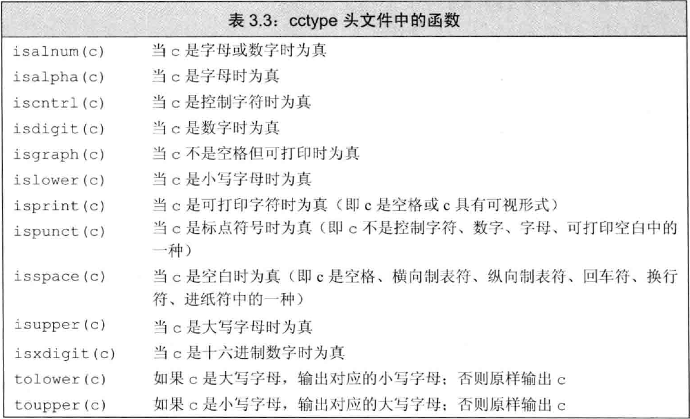
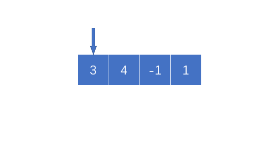
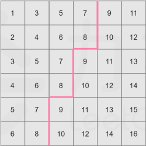
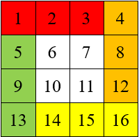

> ## [26.删除排序数组中的重复项](https://leetcode-cn.com/problems/remove-duplicates-from-sorted-array/)<br>
&emsp;&emsp;这题思路相当简单，但是是原地改变数组，我们如果`vector.earse()`方法会改变数组的大小迭代器用不了，那么只能将非重复的数往前‘挪’，但是为了加快程序运行速度，可以直接将采用双指针的方法，$i$、$j$两个指针，其中$i$得到的重复数组，而$j$是遍历数组的指针，碰到`nums[i]!=nums[j]`时，`i++`并`nums[i]=nums[j++]`，经过这两步就可以实现将非重复的元素移到前面，随后使用`vector.pop()`删去最后$j-i$个元素。

>  ## [27.移除元素](https://leetcode-cn.com/problems/remove-element/)<br>
&emsp;&emsp;思路与26大差不离，也是利用双指针，$i$、$j$两个指针，只有初始值的不同，和$i$移动的方式不同而已

> ## [28.实现 strStr()](https://leetcode-cn.com/problems/implement-strstr/)
&emsp;&emsp;在这里我是用的很暴力的算法直接比较，不一样后移，知道找到其实位置或者调出循环

> ## [31.下一个排列](https://leetcode-cn.com/problems/next-permutation/)
&emsp;&emsp;由数学性质可以得到，如果想得到当前排列的下一个序列，仅仅只需要将排名靠后"较大"的数和排名靠前的“较小”的数交换即可，但是题目要求最小，所以需要按照以下策略进行更改
* “较大”的数要尽可能的小
* 将较大的数与前面较小的数交换的时候，**必须**将从交换位置到结束排序，以保证当前序列尽可能靠近交换后的序列
<div align=center>

</div>

> ## [转变数组后最接近目标值的数组和](https://leetcode-cn.com/problems/sum-of-mutated-array-closest-to-target/)
&emsp;&emsp;由数学性质，可以很轻松的推出，当当前数组的元素之和小于`target`时，是不需要转变数组的，即返回当前数组最大值，由于要求求和结果尽可能小并且结果可能并不是当前数组中的值，所以先对目标数组排序后，从左到右遍历(此处用**二分查找应该更快**，懒癌晚期)找到`i`使得`arr[0]+...+arr[i]>target`，则整数`value`的值就在`arr[i-1]`~`arr[i]`之间，在对这个区间进行二分查找，同时记录下$|sum-target|$，当二分查找结束后，即可得到当前`value`

> ## [33.搜索旋转排序数组](https://leetcode-cn.com/problems/search-in-rotated-sorted-array/)
&emsp;&emsp;首先探索下所谓旋转数组的性质，由于是由有序数组旋转得来，则得到的数组必定局部有序，并且对任意一个`i`，只要`nums[i]>=nums[0]`，那么由`0~i`组成的数列必定是有序的，相似的只要`nums[i]<=nums[nums.size()-1]`那么由索引`i~nums.size()-1`对应数组成的数列也必定是有序的。那么对于二分查找而言，由于只存在一个旋转点，那么数组左半部分和右半部分必定至少有一个是有序的，首先判断那一部分有序，然后调整二分查找的左半部分和右半部分，最终就可以得到`target`是否存在于当前数组，以及下标

> ## [34.在排序数组中查找元素的第一个和最后一个位置](https://leetcode-cn.com/problems/find-first-and-last-position-of-element-in-sorted-array/)
&emsp;&emsp;简单粗暴的就是遍历法，由于要求时间复杂度是$O(logN)$级别，方法肯定就是二分查找的方式
* 遍历法：这个不用多说，第一次遇见记录索引，第二次遇见记录索引，没有就`(-1,-1)`
* 二分法：思路很简单，细节是魔鬼。我在写这个代码的时候因为二分的问题进入无限递归，我们需要对二分法进行改造，使得能够找到`target`的左边界和右边界，同时设置一个标志`flag`表示当前二分查找是在寻找左边界还是右边界
    
    > 二分法虽然是在算法入门的时候就学习过的入门级算法，但是老司机还是很容易翻车，因为`int`型二分的问题，可能会陷入死循环，请各位读者在实际操作的时候注意边界

> ## [35.搜索插入位置](https://leetcode-cn.com/problems/search-insert-position/)
&emsp;&emsp;两种方法，一种是暴力法，第二个是二分法
* 暴力法：直接遍历找到第一个比`target`的数，并且返回他的下标就完事了
* 二分法：这一题可以仿照[34题](https://leetcode-cn.com/problems/find-first-and-last-position-of-element-in-sorted-array/),利用二分查找找到`target`的左边界，直接返回左边界就可以了
    
    > 二分查找小技巧：查找有序数组时，如果数组中含有重复元素，采用二分法得到的结果不尽相同，这个判断`mid`的判断顺序有关，当先判<small>$nums_{mid}\leq target$</small>，即搜索区间尽量往左靠拢，最后得到的肯定是左区间，相反<small>$nums_{mid}\geq target$</small>，即搜索区间尽可能往右靠拢，得到的就是右区间，可以作为类似题目的模板使用！

> ## [36.有效数独](https://leetcode-cn.com/problems/valid-sudoku/)
&emsp;&emsp;将9X9的数独方格，分成三种有效区域，分别是行(row)列(column)九宫格(block)，分别统计当前的区域内有无重复数字，存在重复数字，则该九宫格无效
* 行、列都很容易表示所属于的区域，九宫格可以<small>$(row/3)\times3+column/3$</small>得到所属区域
<div align=center>

</div>

> ## [1014. 最佳观光组合](https://leetcode-cn.com/problems/best-sightseeing-pair/)
&emsp;&emsp;思路就是将公式拆开来看，<small>$A[i]+A[j]+i-j \Longleftrightarrow (A[i]+i)+(A[j]-j)$</small>，在遍历的过程中，<small>$A[j]-j$</small>是不会变的，等于说我们需要在<small>$[0,j-1]$</small>范围内找到一个最大的 <small>$A[i]+i$</small>，所以我们在遍历的过程中维护这一个 <small>$max(A[i]+i)$</small>这一结构，就可以在 <small>$O(N)$</small>复杂度计算出所谓最佳的观光组合。
<div align=center>

</div>

> ## [37.解数独](https://leetcode-cn.com/problems/sudoku-solver/)
&emsp;&emsp;经典解数独问题，这个主要用到两个思想
* 约束的思想：即当比如我们在某一个空格填上“1”，那么我们在这个空白所处的行、列、九宫格中就不能出现第二个"1"，我们需要解决如何知道"1"是否在所属于行、列、九宫格中出现过，就需要用到标记
* 回溯：当我们发现在某一格填写"1"不能完成数独时，那么就只能返回上一个地方重新尝试其他的数字
&emsp;&emsp;依据这两种方式，我们就可以完成解数独程序 [官方题解](https://leetcode-cn.com/problems/sudoku-solver/solution/jie-shu-du-by-leetcode/)

> ## [38.外观数列](https://leetcode-cn.com/problems/count-and-say/)
&emsp;&emsp;基本思路，初始化时记录第一个数字，然后遍历该字符串，直到碰到不同的字符，将字符的数量写入外观数列中，随后写入字符，更新字符和长度，直至到字符串结尾。
<div align=center>

</div>

> ## [39.组合总和](https://leetcode-cn.com/problems/combination-sum/)
&emsp;&emsp;为了在组合时避免去重，首先对输入数组排序。采用回溯和深度优先的思想，如下图所示，当 `target=7`，第一次选择2，问题就成了 `target=5`，一直递归下去直到 `target=0`或者不符合条件退出,图源来自于 [liweiwei1419](https://leetcode-cn.com/problems/combination-sum/solution/hui-su-suan-fa-jian-zhi-python-dai-ma-java-dai-m-2/)的[题解](https://leetcode-cn.com/problems/combination-sum/solution/hui-su-suan-fa-jian-zhi-python-dai-ma-java-dai-m-2/)
<div align=center>

</div>

> ## [40.组合总和II](https://leetcode-cn.com/problems/combination-sum-ii/)
&emsp;&emsp;与39题一脉相承的思路，但是观察例子不难发现，给出例子之中存在重复的数，并且要求的是每一个存在的数只能在一个解中出现一次，例如一共有两个数字2，那么解中最多不能出现超过两个2。还有一个是去除重复解的问题，如果继续按照 [39](https://leetcode-cn.com/problems/combination-sum/)中的思路，将会存在问题，所以采用一个 `while`循环去重 
```C++
while (i < candidates.size() - 1 && candidates[i + 1] == candidates[i])
    i++;
```
保证开头的数，每一次都不是重复的，`while`循环加上，其他的与39题没有区别

> ## [125.验证回文子串](https://leetcode-cn.com/problems/valid-palindrome/)
<div align=center>

</div>
&emsp;&emsp;这一题也没有什么好说的，前后两个指针扫描，但是有一点，我们需要忽略字母大小写、标点符号、空格等的干扰，只单单看字母和数字，这是就可以用到上述部分的函数`isalnum(c)`和 `tolower(c)`两个库函数判断当前字符是否符合要求。

> ## [67.二进制求和](https://leetcode-cn.com/problems/add-binary/)
&emsp;&emsp;开始的我陷入了一个误区就是穷举`a[i]`、`b[j]`和`temp`所有可能性，但是由于每个变量都是`0`或者`1`，所以就造成了最起码有四种情况需要考虑，分别是留1进1、留1进0、留0进1、留0进0，情况非常多写起来也很费事，但是将字符的判断转换成实际三个数相加就不需要考虑这么多种情况，于是可以利用下列代码判断进几留几
```C++
temp = (a[i] - '0') + (b[j] - '0') + temp;
res.insert(0, to_string(temp % 2));
```
&emsp;&emsp;最后处理下字符串`a`或者`b`的剩余字符，以及进位，大功告成

> ## [41.缺失的第一个正数](https://leetcode-cn.com/problems/first-missing-positive/)
&emsp;&emsp;缺失的第一个正数最好做的就是遍历找到那个最小的没有出现的正数，时间复杂度为 <small>$O(N^2)$</small>，为加快速度，可以先对整个数组排序，然后遍历找到最小的正数，时间复杂度为<small>$O(nlogn)$</small>；而题目的要求是在 <small>$O(N)$</small>时间内使用常数量级空间，可以使用原地hash，然后扫描 `nums[i]!=i+1`，返回 `i+1`
```C++
while (i + 1 != nums[i] && nums[i] > 0 && nums[i] <= nums.size() && nums[i] != nums[nums[i] - 1])
{
    temp = nums[i];
    nums[i] = nums[nums[i] - 1];
    nums[temp - 1] = temp;
}
```
&emsp;&emsp;上述代码就是进行原地hash的一个元素的过程，交换当前 `nums[i]`和 `nums[nums[i]-1]`，并且继续检查是否符合条件(我们可以很轻易分析得到第一个未出现正数的范围肯定在 <small>$[1,n+1]$</small>),原地hash完成后，扫描得到结果
<div align=center>

</div>

> ## [43. 字符串相乘](https://leetcode-cn.com/problems/multiply-strings/)
&emsp;&emsp;模拟乘法过程，依次累乘，结果加在一起的暴力算法

> ## [49. 字母异位词分组](https://leetcode-cn.com/problems/group-anagrams/) <br>
&emsp;&emsp;首先有一个思路，就是如果一个字符串是由完全相同的元素构成的（符号表，和每个符号的数量），那么对这个字符串排序，那么得到的一定是两个完全相同的字符串。随后使用`unordered_map`计算每一种字符串出现的下标，遍历完成后再次遍历，将相同字符串下的下标对应的原字符串写入结果`res`中，得到答案。

> ## [50. Pow(x, n)](https://leetcode-cn.com/problems/powx-n/)
&emsp;&emsp;最简单暴力的方式就是一个循环，累乘得出结果，但是按照规律我们可以得到次方的规律，如下面两组公式可以得出 
$$
(2^n)^2=x^{n\times2}
$$
$$
7=2^0+2^1+2^2
$$
其中 <small>$(2^1)^2=2^2$</small>，即我们在计算 <small>$2^7$</small>的过程中可以不断平方的方式计算，这样我们就可以在 <small>$\lfloor log_27 \rfloor+1$</small>个循环之中完成次方运算。

> ## <span id="378">[378.有序矩阵中第K小的元素](https://leetcode-cn.com/problems/kth-smallest-element-in-a-sorted-matrix/)</span>
&emsp;&emsp;首先，最容易就是暴力法，直接将矩阵变换成一维数组排序，没有利用到矩阵的性质，随后我们注意到，矩阵的行和列都是递增的，那么我们可以将整个矩阵按行或者按列归并排序，归并到k个停止，但是这样做行或者列中的递增性质没有利用到，那么由图中可以得到，所有的 `matrix[i][j]<=mid`的集中在左
<div align=center>

</div>

角，那么我们可以从最后一行扫描，当前行小于等于`mid`那么，当前列这一行之前的所有数均小于`mid`，累加直至第一行。
```C++
while (i >= 0 && j < n)
{
    if (matrix[i][j] <= mid)
    {
        num += (i + 1);
        j++;
    }
    else
        i--;
}
```

> ## <span id="54">[54.螺旋矩阵](https://leetcode-cn.com/problems/spiral-matrix/)</span>
&emsp;&emsp;按照层遍历矩阵，每一层可以分为四个部分，四个部分大小由当前限制条件约束，分别是`up`, `down`, `left`, `right`。按照层遍历矩阵直到`up==down`或者`left==right`结束,下图是遍历一层矩阵的示意图和代码
```C++
for (int j = left; j < right; j++)
    res.push_back(matrix[up][j]);
for (int j = up; j < down; j++)
    res.push_back(matrix[j][right]);
for (int j = right; j > left; j--)
    res.push_back(matrix[down][j]);
for (int j = down; j > up; j--)
    res.push_back(matrix[j][left]);
```
<div align=center>

</div>

> ## [56. 合并区间](https://leetcode-cn.com/problems/merge-intervals/)
&emsp;&emsp;合并区间，首先有个性质对于两个区间$[left_{1},right_{1}]$,$[left_{2},right_{2}]$，只要符合 <small>$left_1 \le left_2 \le right_1$</small>或者 <small>$left_2 \le left_1 \le right_2$</small>，就可以说着两个区间重合。那么首先将区间按照左区间排序，这样左区间是按照递增顺序排列的，只需要判断<small>$left_1 \le left_2 \le right_1$</small>就可以判断相邻区域有无重合区域，同时将区域合并，继续与下一个区域比较，知道没有重合，进行下一个，注意边界问题！！！

> ## [58. 最后一个单词的长度](https://leetcode-cn.com/problems/length-of-last-word/)
&emsp;&emsp;要求给出最后一个单词的长度，那么从后往前扫描，从扫描到第一个字母开始，进入循环找到第一个空格返回，从而得到最后一个单词的长度。

&emsp;&emsp;**注意下标超限**：在下面的`while`循环中，需要首先判断下标的是否在有效的范围内，然后才可以对整个数组取值（有的编译器比如我在用的clang++不会报错，但是Leetcode会报数值溢出），养成好的习惯不会调代码调到头秃。
```C++
for (int i = s.size() - 1; i >= 0; i--)
{
    if (isalpha(s[i]))
    {
        while (i >= 0 && isalpha(s[i]))
        {
            res++;
            i--;
        }
    }
    break;
}
```

> ## [59. 螺旋矩阵 II](https://leetcode-cn.com/problems/spiral-matrix-ii/)
&emsp;&emsp;看题目就可以得到当前题目与[螺旋矩阵](https://leetcode-cn.com/problems/spiral-matrix/)是一个思路，就是通过一层一层的方式遍历数组，最后完成整个数组的赋值，图见[螺旋矩阵](#54)
```C++
for (int j = left; j < right; j++)
    matrix[up][j] = ++cnt;
for (int j = up; j < down; j++)
    matrix[j][right] = ++cnt;
for (int j = right; j > left; j--)
    matrix[down][j] = ++cnt;
for (int j = down; j > up; j--)
    matrix[j][left] = ++cnt;
```

> ## [65.有效数字](https://leetcode-cn.com/problems/valid-number/)
&emsp;&emsp;这可能是我做过提交次数最多的一题了，需要考虑到很多情况，官方题解给出的有限自动机我自认为再来一题我还是白给，所以自己将题目按照错误提示逐一修改，最后AC
* 如果字符串当前是数字`0-9`，标记`+/-`出现，因为`+/-`只能出现在数字开始或者是指数开始部分，所以出现过数字并且没有出现过指数符号`e`就不能出现`+/-`
* 如果字符串当前字符是`.`，
    * `.`符号左或者右必须出现数字，否则是无效的
    * `.`符号后不能出现`+/-`，否则是无效的
* 如果符号串当前字符是`e`,
    * 重置`+/-`出现标记，并且将`.`标记为已出现
    * 同时检查前文是否有效
* 空格在开头结尾均为有效，在字符串中，无效
* 其余情况皆返回`false`

> ## [66. 加一](https://leetcode-cn.com/problems/plus-one/)
&emsp;&emsp;没啥好说的，模拟实际加的过程，其中加速技巧就是判断进位，由于是对一个数+1，所以当不再进位的时候，高位数肯定不会变，所以如果进位为0，直接放回当前的`digits`

> ## [68. 文本左右对齐](https://leetcode-cn.com/problems/text-justification/)
&emsp;&emsp;这一题的主要思路其实很简单，主要是边界的界定很恶心。
分类讨论：
* 如果当前行是最后一行，即`i==words.size()`的时候，我们只需要每个单词之间加一个空格就好
* 如果当前行不是最后一行，那么由`while`循环可以得到构成当前行的开头和结尾，计算当前单词的长度总和`wordlength`，那么每个单词间的长度只有两种情况，要么是`space_num / (cnt - 1)`,`space_num / (cnt - 1) + 1`，以上两种情况主要对应空格正好均分和不能均分。

> ## [69. x 的平方根](https://leetcode-cn.com/problems/sqrtx/)
&emsp;&emsp;其实这题思路很简单，只是在细节上要注意，如果我们采用二分法查找时，会出现数据溢出现象，所以在计算式需要强制转换数据类型，将`int`强制转换成`long long`型，这样数据才不会溢出
&emsp;&emsp;其实官方题解给出了另一种很巧妙的方法，利用指数函数和对数函数代替开平方根计算，虽有取巧之嫌但是是真滴巧妙 
$$
\sqrt{x}=x^\frac{1}{2}=(e^{lnx})^\frac{1}{2}=e^{\frac{1}{2}lnx}
$$

> ## [315.计算右侧小于当前元素的个数](https://leetcode-cn.com/problems/count-of-smaller-numbers-after-self/)
&emsp;&emsp;引进一个新的高级数据结构树状数组，[参考讲解](https://leetcode-cn.com/problems/count-of-smaller-numbers-after-self/solution/shu-zhuang-shu-zu-by-liweiwei1419/)这位比我讲述的更为清楚，我只是将我的理解以一种较为易懂的方式描述出来。树状数组主要计算数组的区间和或者前缀和，就本题而言，想要得到某一个数的前面有多少个数，即排位，我们可以利用树状数组计算其前缀和，那么我们只需要对数组`nums`从后往前遍历，遍历的过程中计算对应`Rank`之前的前缀和得到当前数右边有多少数小于它，同时更新树状数组就可以完成此项任务。
* 树状数组的单点更新，置于具体为什么要这样子更新请详细在网上或者我给出的参考链接找到答案，笔者目前没有那个能力将这个数据结构描述的很清楚。
```C++
int low(int x)
{
    return x & -x;
}

void updata(vector<int> &c, int i)
{
    while (i < c.size())
    {
        c[i]++;
        i += low(i);
    }
    return;
}
```
* 树状数组的查询
```C++
int query(vector<int> &c, int i)
{
    int sum = 0;
    while (i > 0)
    {
        sum += c[i];
        i -= low(i);
    }
    return sum;
}
```

> ## [350.两个数组的交集](https://leetcode-cn.com/problems/intersection-of-two-arrays-ii/)
* 对两个数组排序，并且设置两个指针指向两数组第一个节点，分为三种情况
    * `nums1[i]<nums2[j]`：`i++`
    * `nums1[i]>nums2[j]`：`j++`
    * `nums1[i]==nums2[j]`：添加结果，并双指针递增
* 由于数组排序需要耗费大量时间，所以采用Hash表的做法，遍历`nums1`,得出每个元素的出现次数，然后遍历`nums2`，每遇到`Hash[nums2[i]]!=0`，将该数加入结果数组中，并且对应Hash表的值自减。

> ## [71.简化路径](https://leetcode-cn.com/problems/simplify-path/)
&emsp;&emsp;出现的字符主要可以分为四种情况
* `/`：表示路径之间分隔符
* `..`：返回上一级，即将路径中的上一个刚刚添加的子目录弹出
* `.`：直接跳过
* 正常字符串：填入目录集合中

> ## [73. 矩阵置零](https://leetcode-cn.com/problems/set-matrix-zeroes/)
&emsp;&emsp;这题之所以是`mid`难度，是因为题目的要求是在原地对矩阵置0，不能使用额外的空间，所以当我们每遇见一个0，按照要求置0的话。那么反复置0同一位置，导致时间效率的降低。所以我们采用第一列和第一行作为标志位，首先遍历数组，如果`matrix[i][j]==0`，将该列的第一行和该行的第一列置0，表示这一行或者一列有0，完成后，从**1**开始按照标志位将所在行或者列置0，然后按照前文的`flag_r, flag_c`标志位作为第一行和第一列有无0将第一行或者第一列置0.

> ## [74. 搜索二维矩阵](https://leetcode-cn.com/problems/search-a-2d-matrix/)
&emsp;&emsp;可以将矩阵映射成为一个一维矩阵，并且在这个基础之上做二分。置于以第一列确认数字在哪一行，二次二分我觉得代码不好写，面试的时候调bug没有那么多时间。可以顺手看看习题 [有序矩阵中第K小的元素](#378)，有共通之处。

> ## [75. 颜色分类](https://leetcode-cn.com/problems/sort-colors/)
* 两次遍历：遍历第一遍将统计每个颜色的个数，第二遍将颜色填入原数组
* 一次遍历：三个指针，`p0`,`p1`,`cur`分别指向数组开始、结束以及中间位置（这只是一个形象的说法），
    * `nums[cur]==0`，与`p0`指向的值互换且`cur>=k`，`p0++, cur++`
    * `nums[cur]==1`,`cur++`
    * `nums[cur]==2`, 与`p1`指向的值互换`p1--`

> ## [78.子集](https://leetcode-cn.com/problems/subsets/)
* 递归法：这种涉及到字符串子集的题目都可以采用递归的方式，自己问题等同于一个完全二叉树，一共有 <small>$2^n$</small>个子集，不涉及到回溯问题，直接递归，每个两种选择就可以了。
* **字典序法**：上面也说过，一个集合的子集共有<small>$2^n$</small>个子集，所以可以用<small>$0 - 2^n$</small>次循环，循环次数 <small>$i$</small>每一位对应相应下标元素是否被加入到集合中。比如说`[1,2,3]`,那么集合的循环应该在<small>$0 - (2^n-1)$</small>，比如在第7次循环中，7的二进制表示是 <small>$(111)_{2}$</small>，所以三个元素都会被选到，那么该循环对应的子集就是`[1,2,3]`

> ## [81. 搜索旋转排序数组 II](https://leetcode-cn.com/problems/search-in-rotated-sorted-array-ii/)
&emsp;&emsp;题目中给到，有序数组在某个点上进行了旋转（对比[搜索旋转排序数组](https://leetcode-cn.com/problems/search-in-rotated-sorted-array/)），并且这个有序数组中存在相同的元素，如果想要尽可能加快搜索速度，可利用数组的局部有序的观点计算，数组情况分为三种情况考虑([搜索旋转排序数组](https://leetcode-cn.com/problems/search-in-rotated-sorted-array/)中无重复数据，所以只需要考虑两种情况)
* `1 3 1 1 1`：仅仅靠`low`,`mid`,`high`分辨不出哪一个部分是有序的，所以即`nums[low]==nums[mid]`情况，将`low++`，避免重复值的出现干扰计算。
* `4 5 6 1 2`：`nums[low] < nums[mid]`，数组的左半部分肯定是有序，判断是否在左半部分，不在就在右半部分
* `5 6 1 2 4`：`nums[low] > nums[mid]`，数组的右半部分肯定是有序，
判断是否在右半部分，不在就在左半部分

> ## [153. 寻找旋转排序数组中的最小值](https://leetcode-cn.com/problems/find-minimum-in-rotated-sorted-array/)  <br>[154. 寻找旋转排序数组中的最小值 II](https://leetcode-cn.com/problems/find-minimum-in-rotated-sorted-array-ii/)
&emsp;&emsp;如果采用二分，就需要分类讨论其中可能出现的可能，确定最小值是在左边还是右边
* 如果`nums[mid]>nums[high]`：那么右半部分肯定是有序的，并且 `nums[mid]`右半部分的最小值，所以舍弃右半部分
* 如果 `nums[mid]<nums[high]`：最小值肯定在当前`mid`的右边，舍弃左半部分
* 如果 `nums[mid]==nums[high]`：如果数组中存在重复数值，那么需要对`high--`，因为在现有数组中当前`nums[high]`的替代品，所以就算是`nums[high]`是最小值，也不会有漏掉最小值的问题

> ## [410. 分割数组的最大值](https://leetcode-cn.com/problems/split-array-largest-sum/)
* **动态规划**：**「将数组分割为 mm 段，求……」是动态规划题目常见的问法**，所以采用动态规划解题。`dp[i][j]`表示将前`i`个数分成 `j`段，可以将问题分解为更小的问题，假设前`k`个数，被分成 `j-1`段，剩余`k+1~i`被分为一段，那么我们只需要枚举`k`，而`k`的范围易得为 <small>$0\le k < i$</small>，当`k`为0时，表示前`i`个数被分为一段，那么状态转移方程就可以写为。并且在对数组分段中当<small>$j>i$</small>时，将长为`i`
$$
f[i][j]=\min _{k=0}^{i-1}\{\max (f[k][j-1], s u b(k+1, i))\}
$$
的数组分为`j`段是并不合法的，由于我们最终的答案是各段子数组和的最大值的最小值，所以当<small>$j>i$</small>时，将 $dp_{i,j}=+\infty$即可，由于我们需要保证最后一段分段的合法性，所以最后一定最少留一个数，所以`k`最多到前`i-1`个数。最后返回的结果是`dp[n][m]`
* **二分查找**：**「使……最大值尽可能小」是二分搜索题目常见的问法**。这题目的答案一定在$[max(nums), sum(nums)]$区间内，那么我们采用二分法，确定一个数字，使得最终分段的段数跟目标段数相等，且值最小。假设我们得到一个数作为数组分段的最大值，那么所有子数组的和都不能大于该值，我们遍历数组，在遍历的过程中累加元素，如果当前元素和大于该数，则`cnt++`表示又切分出一个子数组，
    * 如果切分出的子数组大于给定目标子数组数量，那么说明区间和的最大值给的较小，`low = mid + 1`;
    * 如果切分出的子数组小于等于给定目标子数组数量，那么说明区间和的最大值可能较大，`high = mid`

> ## [89. 格雷编码](https://leetcode-cn.com/problems/gray-code/)
&emsp;&emsp;格雷编码相邻数字只有一位数不一样，并且总共有 <small>$2^n$</small>个编码，相邻编码可以从低到高将某一位取反，取反得到的结果检查是否出现即`flag[temp]==true`，如果出现，恢复当前位扫描高一位；否则直接将该值加入结果集合，跳出循环。继续扫描寻找下一位数。比如当`n=3`时，假设当前的格雷编码是 <small>$011$</small>，那么按照上述算法，从最低位扫描取反 <small>$010$</small>未出现，将`2`计入结果集合。依次类推......

> ## [90. 子集 II](https://leetcode-cn.com/problems/subsets-ii/)
&emsp;&emsp;由于存在重复，所以在进行递归的同一层次，需要对元素去重，但是这种去重仅限于同层去重，不是同一层去重结果子集不完整。
```C++
if (i > current && nums[i] == nums[i - 1])
    continue;
```
> ## [91. 解码方法](https://leetcode-cn.com/problems/decode-ways/)
&emsp;&emsp;本题思路和[爬楼梯](https://leetcode-cn.com/problems/climbing-stairs/)很类似，不过在本题中需要一些特殊情况的判断
* 预处理：`s[0]=='0'`，当前字符串不可能成功编码，直接返回`0`;
* 动态规划，申请一个长为`s.length()+1`的整数数组，并且将`dp[0], dp[1]`初始化为`1`，初始位置从`i=1`开始
    * 如果当前数是`0`，并且`i-1`也是`0`，那么直接返回0，不可能编码方式可以编码连续的两个`0`
    * 如果当前数是单独编码，且单独编码有效
    $$dp_{i+1}=dp_{i+1}+dp_i$$
    * 如果当前数和前一个数共同编码，并且单独编码有效（$10\le x\le 26$），那么
    $$dp_{i+1}=dp_{i+1}+dp_{i-1}$$