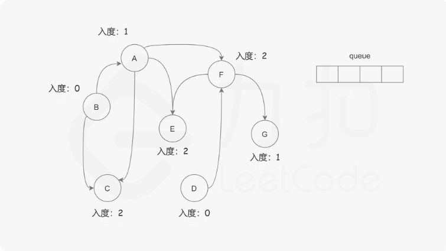

> ## [785. 判断二分图](https://leetcode-cn.com/problems/is-graph-bipartite/)
&emsp;&emsp;本质上是图的搜索，可以采用深度优先搜索或者广度优先搜索都可以，详见 [我的博客](https://singleplus.gitee.io/blog/)，刚刚搭建起来近期应该会更新。

> ## [207. 课程表](https://leetcode-cn.com/problems/course-schedule/)
&emsp;&emsp;图的拓扑排序，某一个课程只有修完这个课程的所有的前置课程才可以修习，转换成图来说，只有一个节点的入度为0时，该节点才可以被访问。所以本题可以采用一张表维护当前状态下的每一个课程前置课程的数量即图节点的入度

> ## [130. 被围绕的区域](https://leetcode-cn.com/problems/surrounded-regions/)
&emsp;&emsp;被围绕的区域，也就是在该区域外部都有字符`X`环绕，所有不满足该条件的都是直接或者间接的与矩阵边框`O`字符接触，所以只需要以边缘位置`O`字符为起点，对矩阵进行遍历，遍历方向为上、下、左、右，遍历到'O'标记，所有边框上的`O`深度遍历完成后，开始将未标记的`O`元素改为字符`X`，标记的元素更改为`O`，算法完成。