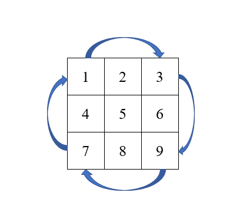

> ## [48.旋转图像](https://leetcode-cn.com/problems/rotate-image/)
&emsp;&emsp;模拟一遍程序实际运行的过程，我们就可以知道转换的规律，并且旋转元素的周期是4，即四个元素后回到
$$matrix(i,j)\longrightarrow matrix(j, matrix_{size}-i-1)$$
原点，如下图所示。那么我们就可以直接得到方法，就是从内层往外层扩散，直至最外层循环结束。一个旋转周

期，我们采用一个4维数组维护当前数，保证交换正确性，根据规律依次改变交换目标的行列值，最后结束一次旋转周期。