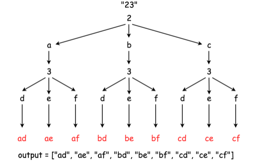
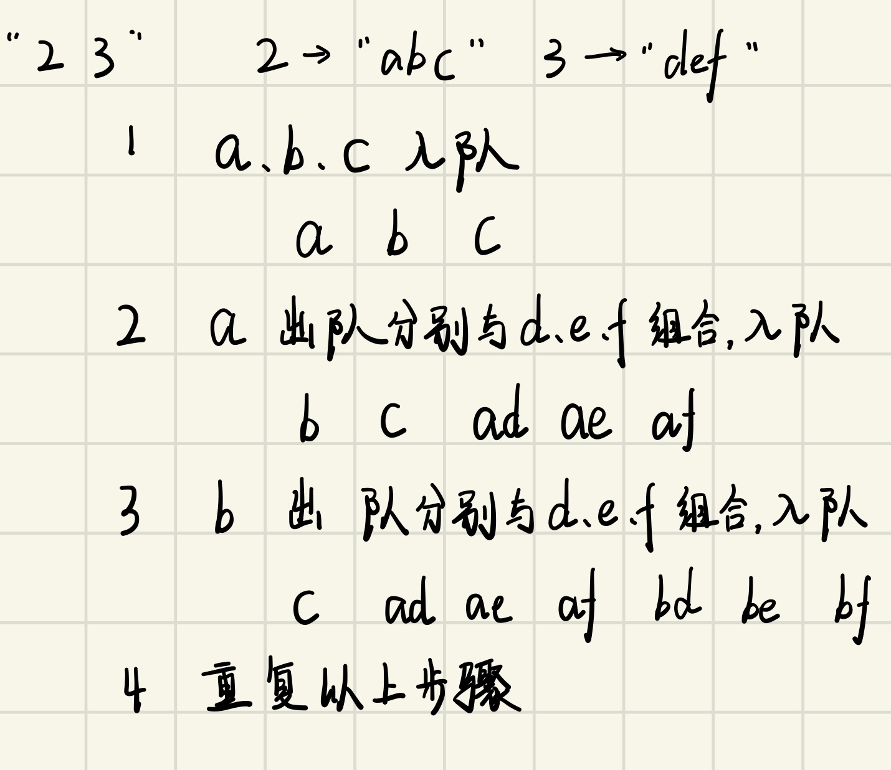
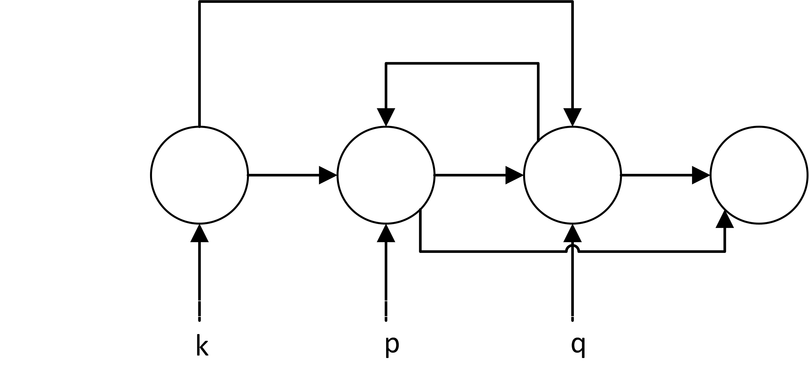

# Practice-Leetcode
一个学生党Leetcode刷题之路，欢迎交流

## 16.[最接近的三数之和](https://leetcode-cn.com/problems/3sum-closest/)
&emsp;&emsp;这题思路和之前[Leetcode15](https://leetcode-cn.com/problems/3sum/)特别相似只是由固定变为了最接近目标数的值
* 首先暴力的方法并不可取，暴力枚举会使程的时间复杂度达到$O(N^3)$量级
* 可以将“接近”这一概念转化成绝对值的形式就可以得到当前三数之和与$target$的距离
$$distance = abs(nums_1+nums_2+nums_3-target)$$
*  距离不断接近的过程可以借用三数之和等于固定值得思路，将数组排序后计算$nums_i+nums_j+nums_k$,如果$nums_i+nums_j+nums_k > target$, k--,如果$nums_i+nums_j+nums_k < target$，j++，$nums_i+nums_j+nums_k == target$直接返回结果
    
## 17.[电话号码的字母组合](https://leetcode-cn.com/problems/letter-combinations-of-a-phone-number/)
&emsp;&emsp;这题若是定长度数字字符，列举出所有的英文字符组合，可以很轻松的通过枚举的方式得出结果，但是输入字符不定长，嵌套的循环数目就不等，所以不能枚举方式列出所有的字符组合。
1. 递归回溯(不知道这样说正不正确，但这个是我的理解)
    - 循环数目不能够确定，可以通过递归的方式层层嵌套循环，累加
    
2. 队列
    - 循环嵌套的层数未知，但是我们可以凭借队列的先入先出的性质实现字符的组合
    

## 18.[四数之和](https://leetcode-cn.com/problems/4sum/)
&emsp;&emsp;本题目解法和两数之和与三数之和的思路并没有任何不同，只不过是2->3->4的思路的拓展
* 同样是第一步对原始数组排序
* 从数组任意两个数$nums_i, nums_j, j > i$，这就变为在数组中去除取出的两个数的两数之和的问题，利用双指针法即可解决
* 值得注意的是边界问题和答案重复的问题
    1. 边界问题：$i<nums.size-3, j<nums.size-2$
    2. 结果去重，遍历$i, j$的时候，如果当前$nums_i(nums_j)$与前一个数相等，就不需要重复计算寻找和了，直接进入下一个循环

## 19.[删去链表中的倒数第$n$个节点](https://leetcode-cn.com/problems/remove-nth-node-from-end-of-list/)
1. 常规解法：通常想要知道倒数第$n$个节点的位置并删除改节点，我们需要知道链表的长度，才能精确定位到倒数$n+1$个节点的位置，删去然后释放倒数第$n$个节点的空间，需要遍历两次链表(最坏情况下)
2. 可以设置双指针$q,p$，使得$q$比$p$先“走”n步，然后$p$跟随着$q$继续走，当$q$走到尽头时，$p$正好指向要删除节点的前一个节点，省去一次遍历的时间
 

**注意链表的边界问题，当$n=length(ListNode)$即删除第一个节点时，无法指向第一个节点的指针，所以应当建立一个新的节点解决该问题，不要忘记新建虚拟节点和删除节点的空间释放**

## 20.[括弧匹配](https://leetcode-cn.com/problems/valid-parentheses/)
&emsp;&emsp;基本的机试题目，利用栈实现判断是否是有效的字符串
 

**边界条件：括弧匹配到')'、'}'、']'时，需要判断栈是否为空**

## 21.[合并有序链表](https://leetcode-cn.com/problems/merge-two-sorted-lists/)
&emsp;&emsp;新建一个节点指针，依次遍历，将小的放入新建链表(虚拟)中，直至其中一个链表指针遍历完成，最后将较长的链表剩余部分接入链表中。注意两个链表全为空的特殊情况判断。

## 22.[括号生成](https://leetcode-cn.com/problems/generate-parentheses/submissions/)
&emsp;&emsp;我的第一想法就是暴力法，直接枚举出所以的可能性，但是复杂度太高，遂放弃了这个想法
* 观察有效括号字符发现在任意一个字符串位置之前所有的"("的数量始终是要大于")"数量的，即左括号的放置并没有限制，而")"只需要比"("少就可以，所以我们需要使用递归的方式逐步得到最终结果
* 动态规划方式：由于字符串要求有效，所以第一个字符必须是'('，那么必定有一个与之匹配的')'，这两个字符之间的字符和')'右边的字符一定是有效的字符串序列，那么整个括号字符串就可以表示为($q$)$p$，假设现在要求取$n$对括号的有效序列，那么$q+p=n-1$，即$q$、$p$是由总数$n-1$个括号对组成的，当将$q$从$0$~$n-1$遍历后，那么$n$的所有有效序列得到了。

## 23.[K排序链表](https://leetcode-cn.com/problems/merge-k-sorted-lists/)
&emsp;&emsp;其中最为朴素的方式当然就是在[合并有序链表](https://leetcode-cn.com/problems/merge-two-sorted-lists/)中那样，只不过编程表头数据比较，取最小后指针后移，效率较低。所以可以利用合并两个有序链表的代码，那么怎么将K个有序链表怎么转换成两个有序链表的合并呢，毫无疑问就是分支递归，将K个问题二分为子问题，直至划分为一个或者两个有序链表的合并

## 24.[两两交换链表中相邻的值](https://leetcode-cn.com/problems/swap-nodes-in-pairs/)
&emsp;&emsp;其实这一题的思路很简单，交换两个相邻的节点，涉及到三个节点`next`指针的变化，自然就需要三个指针来维护节点位置的变化

 
**&emsp;&emsp;注意:由于链表长度可能为奇数也可能为偶数，所以需要判断`p`、`p->next`是否为空。其中`p`为空直接结束循环，`p->next`将`p`指向节点加入链表末端，然后结束循环**

## 25.[K 个一组翻转链表](https://leetcode-cn.com/problems/reverse-nodes-in-k-group/)
&emsp;&emsp;这题是翻转链表和交换相邻链表中的值的结合版本，首先我们知道，翻转链表使用头插法即可，而K个一组无非就是加一个循环判断，记录当前链表的末尾，下一次以这次循环的链表末尾作为起始位置
 
&emsp;&emsp;**当最后链表的剩余长度小于k时，直接将原链表中剩余节点直接计入尾部即可**