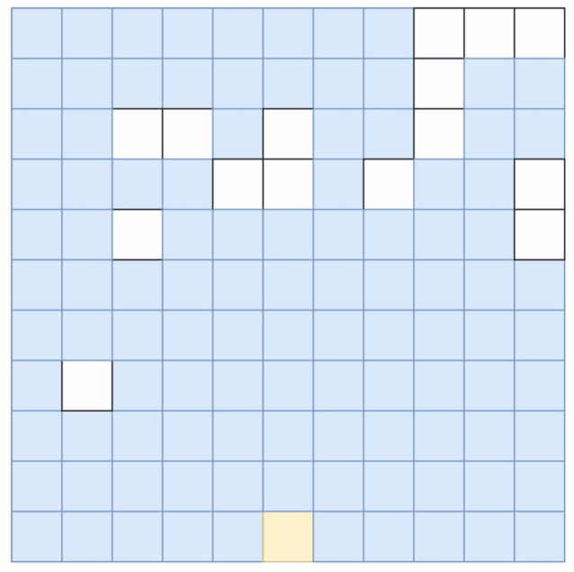

> ## [739.每日温度](https://leetcode-cn.com/problems/daily-temperatures/) 
&emsp;&emsp;这一题有两种解法，分别是暴力法和单调栈法，跟之前的一道题最大矩形的一道题很像
* 暴力法
&emsp;&emsp;暴力法的思想及其简单，类似于双指针，$i$指针为快指针用来遍历，$j$指针用来寻找下标最小的大于`T[i]`的温度
* 单调栈法
&emsp;&emsp;单调栈极其类似，需要找到第一个挡到当前"柱子"的"柱子"，利用单调栈获得。
    >* Example `[73, 74, 75, 71, 69, 72, 76, 73]`
        * 栈为空，73入栈
        * $73<74$, 73出栈，`res[0]=1`,74入栈
        * $75>74$，74出栈，`res[1]=1`,75入栈
        * $75>71$，继续
        按照上述步骤走完就可以得到最终的数组了，由于初始化时`vector`时，内元素被初始化为0，栈内元素就没用动过，在其后即没有哪一天的温度比他高，所以不用管(不知道这是不是我的空间占用大的原因)

> ## [32.最长有效括号](https://leetcode-cn.com/problems/longest-valid-parentheses/)
&emsp;&emsp;本题和判断有效括号字符串思路类似，都是采用栈的方式判断只由'('、')'组成字符串是否有效，由于是需要找到最长有效字符串，所以需要对字符串中子有效字符串的结尾存储在栈中，这样就可以得到最长有效括号
* 初始化一个栈，栈底元素是-1
* 当`s[i]=='('`，将当前下标压入栈
* 当`s[i]==')'`，**弹出**栈顶元素，判断栈是否为空
    * 当栈为空，说明栈中没有元素'('(可以自行构建示例，画图)，将当前`i`压入栈中
    * 当栈不为空，说明栈中有可以匹配的元素')'，弹出栈顶元素后，即可得到当前有效括号的长度
    >  这一题来自官方题解，直接利用栈是不能够计算出最长的有效括号长度的，`-1`、`temp.pop()`的加入可以直接判断当前有效子串的开始位置，神来之笔!

> ## [42.接雨水](https://leetcode-cn.com/problems/trapping-rain-water/)
&emsp;&emsp;看到这种类型的题目我第一个想到的就是单调栈算法，与前面[最大的矩形](https://leetcode-cn.com/problems/largest-rectangle-in-histogram/)一样，也是利用单调栈求当前‘凹’型中能够存的雨水体积，当前情况栈不为空的话，有两种情况
* `height[i]>height[s.top()]`：弹出栈顶，那么距离 `distance=i-s.top()-1`，由于是单调栈，那么一定存在`s.top()>=top`，限制高度为`bound_height=min(height[i], height[s.top()])-height[top]`，然后累加即可
* 当`height[i]<=height[s.top()]`：复合单调栈情况，`continue`
    > 图中的栈中存储的是下标而不是具体数值，只是为了便于理解

> ## [84. 柱状图中最大的矩形](https://leetcode-cn.com/problems/largest-rectangle-in-histogram/)
&emsp;&emsp;单调栈法，利用单调栈计算以某一个高度的矩形的最大面积，同时添加哨兵元素，无需对栈判空，节省时间成本。以图示例`
[2,1,5,6,7,3]`说明单调栈的运行原理：
* 首先对原数组预处理，建立新数组，在原数组的头尾各加一个0，`
[0,2,1,5,6,7,3,0]`
* 栈的初始状态，加入哨兵元素0,处于栈底永远不会被弹出栈，栈永远不为空
* `2`：`2 > 0`压栈
* `1`：`2 > 1`，弹栈计算面积为2，`res = 2`，`1`压栈
* `5`：压入栈中
* `6`：压入栈中
* `7`：压入栈中
* `3`：`5`、`6`、`7`弹栈，计算当前矩形面积`left = st.top()`、`right = i - 1`
* `0`：全部弹栈
算法结束

> ## [85. 最大矩形](https://leetcode-cn.com/problems/maximal-rectangle/)

* **动态规划**：假设我们能够确认以当前格子对应的矩形的最大值，我们只需要确认，左边界 `left`，右边界 `right`，和高`height`，就可以计算出该矩形的面积
* 首先初始化三个数组`left`、`right`、`height`，其中`left`中填充`0`，`right`中填充`n`，`height`中填充`0`
    * `height`状态转移：如果矩阵当前值为`0`，高度为`0`，否则`height[i]++`
$$
height_i=\left\{
\begin{array}{rcl}
height_i+1      &     & matrix[i][j]==1\\
0    &     & matrix[i][j]==0
\end{array} \right.
$$
    * `left`状态转移：当前状态前的情况在未更新的`left`中都已经考虑过，所以只需要考虑当前位置是不是`0` 
$$
left_i=\left\{
\begin{array}{rcl}
max(current\_left, left_i)      &     & matrix[i][j]==1\\
0    &     & matrix[i][j]==0
\end{array} \right.
$$

    * `right`状态转移：与`left`相似，但是要从右边开始更新
$$
right_i=\left\{
\begin{array}{rcl}
min(current\_right, right_i)      &     & matrix[i][j]==1\\
n    &     & matrix[i][j]==0
\end{array} \right.
$$

* **栈**：我们可以将每一层的最大矩形转换成 [柱状图中最大的矩形](https://leetcode-cn.com/problems/largest-rectangle-in-histogram/)中的问题，如果当前`matrix[i][j]=='1'`是，向上找`height`，最后结果写入数组中传入柱状图中最大的矩形对应的函数中，即可以得到每一层最大的矩形，同时在每层最大矩形更新的时候记录全局最大的矩形，可以得到矩阵中的最大矩形面积