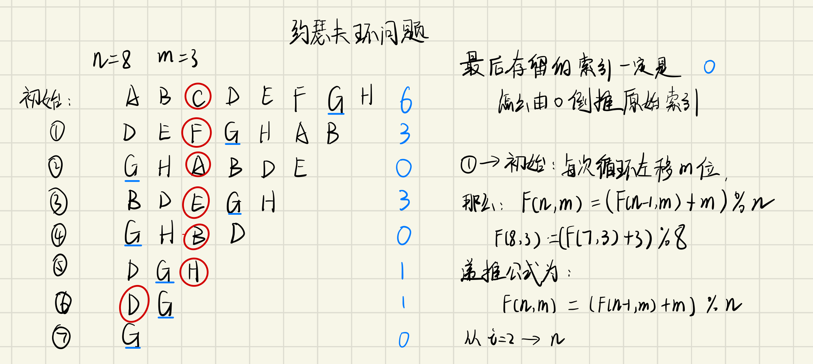
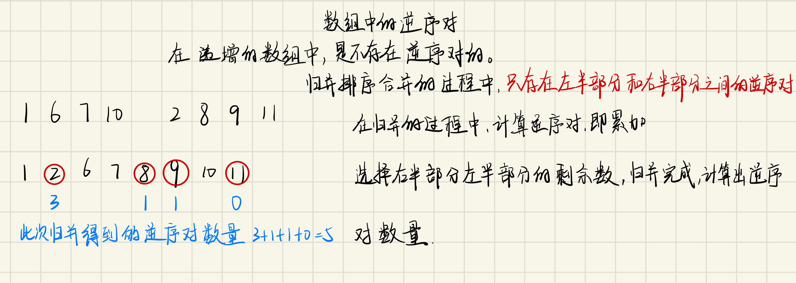

#### [56.圆圈中最后剩下的数字](https://leetcode-cn.com/problems/yuan-quan-zhong-zui-hou-sheng-xia-de-shu-zi-lcof/solution/huan-ge-jiao-du-ju-li-jie-jue-yue-se-fu-huan-by-as/)

从8个人开始，每次杀掉一个人，去掉被杀的人，然后把杀掉那个人之后的第一个人作为开头重新编号
- 第一次C被杀掉，人数变成7，D作为开头，（最终活下来的G的编号从6变成3）
- 第二次F被杀掉，人数变成6，G作为开头，（最终活下来的G的编号从3变成0）
- 第三次A被杀掉，人数变成5，B作为开头，（最终活下来的G的编号从0变成3）
以此类推，当只剩一个人时，他的编号必定为0！（重点！）

现在我们知道了G的索引号的变化过程，那么我们反推一下从N = 7 到N = 8 的过程
如何才能将N = 7 的排列变回到N = 8 呢？
我们先把被杀掉的C补充回来，然后右移m个人，发现溢出了，再把溢出的补充在最前面
神奇了 经过这个操作就恢复了N = 8的排列了！

#### [51.数组中的逆序对](https://leetcode-cn.com/problems/shu-zu-zhong-de-ni-xu-dui-lcof/)

