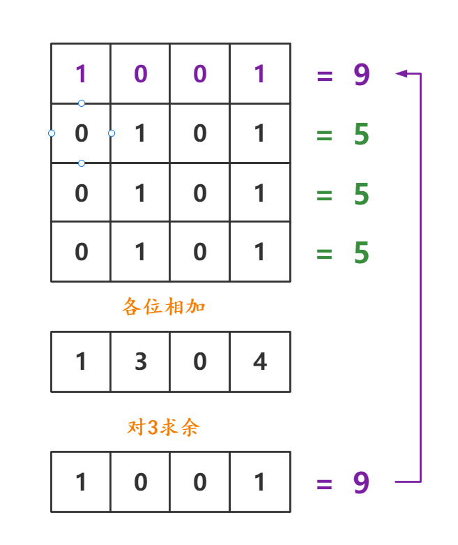

#### [56.圆圈中最后剩下的数字](https://leetcode-cn.com/problems/yuan-quan-zhong-zui-hou-sheng-xia-de-shu-zi-lcof/solution/huan-ge-jiao-du-ju-li-jie-jue-yue-se-fu-huan-by-as/)

从8个人开始，每次杀掉一个人，去掉被杀的人，然后把杀掉那个人之后的第一个人作为开头重新编号
- 第一次C被杀掉，人数变成7，D作为开头，（最终活下来的G的编号从6变成3）
- 第二次F被杀掉，人数变成6，G作为开头，（最终活下来的G的编号从3变成0）
- 第三次A被杀掉，人数变成5，B作为开头，（最终活下来的G的编号从0变成3）
以此类推，当只剩一个人时，他的编号必定为0！（重点！）

现在我们知道了G的索引号的变化过程，那么我们反推一下从N = 7 到N = 8 的过程
如何才能将N = 7 的排列变回到N = 8 呢？
我们先把被杀掉的C补充回来，然后右移m个人，发现溢出了，再把溢出的补充在最前面
神奇了 经过这个操作就恢复了N = 8的排列了！


#### [51.数组中的逆序对](https://leetcode-cn.com/problems/shu-zu-zhong-de-ni-xu-dui-lcof/)


#### [只出现一次的数字](https://leetcode-cn.com/problems/WGki4K/)
题意可知，只有一个数字出现一次并且其余数字均出现三次，那么可以得知，如果对于某一位的和对3取余，必定为0，那么剩余的32位二进制数对应的整数即为出现一次的数。


#### [整数相除](https://leetcode-cn.com/problems/xoh6Oh/)
主体思路就是利用位运算和减法模拟除法过程，麻烦的是边界的处理，以及计算过程中可能出现的问题，同级目录源码中[整数除法](./整数除法.cpp)中，返回前的判断，判明是否超限
```C++
((a > 0 && b > 0) || (a < 0 && b < 0)) && res > (1ull << 31) - 1 // 表明正向超限
((a < 0 && b > 0) || (a > 0 && b < 0)) && res > (1ull << 31)     // 表明负向超限
```
#### [和为k的子数组](https://leetcode-cn.com/problems/QTMn0o/)
优化前缀和可以在常数时间内实现求`nums[i...j]`区间内的和，暴力枚举的区间起点和重点的方式，时间复杂度是$\small{O(N)}$，优化的方式可以采用hash表的方式优化搜索
在搜索的过程中，记录前缀和，并在`value`项记录前缀和为当前值的个数。在搜索的过程中，只需要当前前缀和pre-k的值能够在hash中寻找到，那么就可以确定存在区间的和为k，并且个数为`ump[pre-k]`个，同时初始化时，注意`ump[0] = 1`意思是和为零的下标存在一个。

#### [0和1个数相同的子数组](https://leetcode-cn.com/problems/A1NYOS/)
将01数量相同视作子数组的和为零，具体来说是将0视作-1，并用hash表存储相同前缀和的较小的下标，如果从$[i+1,j]$的和为零，那么以下标为i的前缀和j的前缀和的关系为$sums[j]-sums[i]==0$，这也是hash表中只存储前缀和第一次出现的位置的原因。并且初始化在hash表中存储$udm[0]=-1$保证边界问题。

#### [字符串中的变位词](https://leetcode-cn.com/problems/MPnaiL/)
- 首先明确，没有必要取得一个字符串的所有排列，那样时间代价是显然不可承受的，采取类似于hash的方式将s1字符串中出现的字符存储，滑动窗口的机制，比较s2中比较长度为s1.length()的子串中的各个字符数量是否与s1中相同，如果相同那么存在s1的一个排列，那么返回true，如果查询完成都没有找到满足条件子串，那么返回false
- 当前思路也有优化的空间，采用一个字符串记录，由于之前我们只改变了字符串中至多两个字符，我们只需要记录两个数组中不同的字符有多少个，那么就可以实现比较次数的优化。并且进一步可以将两个计数数组压缩成一个，统计s1和s2子串的差，实现空间优化