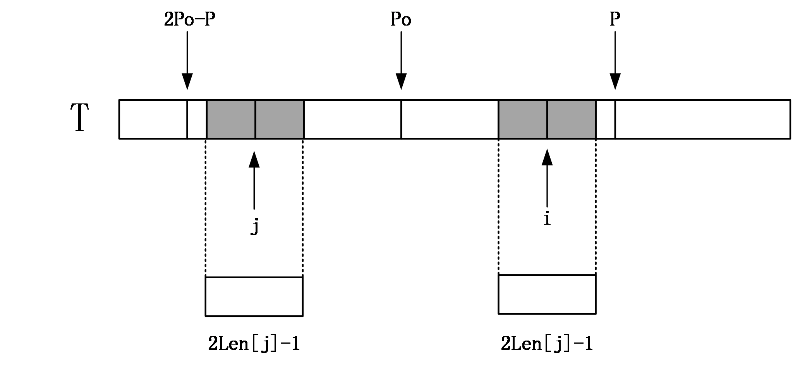

#### [56.圆圈中最后剩下的数字](https://leetcode-cn.com/problems/yuan-quan-zhong-zui-hou-sheng-xia-de-shu-zi-lcof/solution/huan-ge-jiao-du-ju-li-jie-jue-yue-se-fu-huan-by-as/)

从8个人开始，每次杀掉一个人，去掉被杀的人，然后把杀掉那个人之后的第一个人作为开头重新编号
- 第一次C被杀掉，人数变成7，D作为开头，（最终活下来的G的编号从6变成3）
- 第二次F被杀掉，人数变成6，G作为开头，（最终活下来的G的编号从3变成0）
- 第三次A被杀掉，人数变成5，B作为开头，（最终活下来的G的编号从0变成3）
以此类推，当只剩一个人时，他的编号必定为0！（重点！）

现在我们知道了G的索引号的变化过程，那么我们反推一下从N = 7 到N = 8 的过程
如何才能将N = 7 的排列变回到N = 8 呢？
我们先把被杀掉的C补充回来，然后右移m个人，发现溢出了，再把溢出的补充在最前面
神奇了 经过这个操作就恢复了N = 8的排列了！


#### [51.数组中的逆序对](https://leetcode-cn.com/problems/shu-zu-zhong-de-ni-xu-dui-lcof/)


#### [只出现一次的数字](https://leetcode-cn.com/problems/WGki4K/)
题意可知，只有一个数字出现一次并且其余数字均出现三次，那么可以得知，如果对于某一位的和对3取余，必定为0，那么剩余的32位二进制数对应的整数即为出现一次的数。


#### [整数相除](https://leetcode-cn.com/problems/xoh6Oh/)
主体思路就是利用位运算和减法模拟除法过程，麻烦的是边界的处理，以及计算过程中可能出现的问题，同级目录源码中[整数除法](./整数除法.cpp)中，返回前的判断，判明是否超限
```C++
((a > 0 && b > 0) || (a < 0 && b < 0)) && res > (1ull << 31) - 1 // 表明正向超限
((a < 0 && b > 0) || (a > 0 && b < 0)) && res > (1ull << 31)     // 表明负向超限
```
#### [和为k的子数组](https://leetcode-cn.com/problems/QTMn0o/)
优化前缀和可以在常数时间内实现求`nums[i...j]`区间内的和，暴力枚举的区间起点和重点的方式，时间复杂度是$\small{O(N)}$，优化的方式可以采用hash表的方式优化搜索
在搜索的过程中，记录前缀和，并在`value`项记录前缀和为当前值的个数。在搜索的过程中，只需要当前前缀和pre-k的值能够在hash中寻找到，那么就可以确定存在区间的和为k，并且个数为`ump[pre-k]`个，同时初始化时，注意`ump[0] = 1`意思是和为零的下标存在一个。

#### [0和1个数相同的子数组](https://leetcode-cn.com/problems/A1NYOS/)
将01数量相同视作子数组的和为零，具体来说是将0视作-1，并用hash表存储相同前缀和的较小的下标，如果从$[i+1,j]$的和为零，那么以下标为i的前缀和j的前缀和的关系为$sums[j]-sums[i]==0$，这也是hash表中只存储前缀和第一次出现的位置的原因。并且初始化在hash表中存储$udm[0]=-1$保证边界问题。

#### [字符串中的变位词](https://leetcode-cn.com/problems/MPnaiL/)
- 首先明确，没有必要取得一个字符串的所有排列，那样时间代价是显然不可承受的，采取类似于hash的方式将s1字符串中出现的字符存储，滑动窗口的机制，比较s2中比较长度为s1.length()的子串中的各个字符数量是否与s1中相同，如果相同那么存在s1的一个排列，那么返回true，如果查询完成都没有找到满足条件子串，那么返回false
- 当前思路也有优化的空间，采用一个字符串记录，由于之前我们只改变了字符串中至多两个字符，我们只需要记录两个数组中不同的字符有多少个，那么就可以实现比较次数的优化。并且进一步可以将两个计数数组压缩成一个，统计s1和s2子串的差，实现空间优化

#### [回文子字符串的个数](https://leetcode-cn.com/problems/a7VOhD/)
- 常见思路，遍历寻找当前字符串中，以`s[i]`为中心的奇数个回文串的最大长度，遍历整个数组，接下来同理以`s[i]s[i+1]`为中心的偶数长度的回文串的最大长度，最后在$O(N^2)$的时间复杂度内计算得到回文子字符串的个数。并且此思路同样适用于[最长回文子串](https://leetcode-cn.com/problems/longest-palindromic-substring/)。
> 注意在这里，遍历得到的最大长度为$n$的回文串，可以有$n/2+n\%2$个回文串。

- 马拉车算法：在上文中，我们同样重复计算了部分字符串，即之前的结果并没有利用上，马拉车算法就是为了解决这一问题。
    - 首先为了处理奇数长度和偶数长度回文串的问题，马拉车算法对目标字符串进行处理，至于作用接下来会说明
        > abaaab -> @#a#b#a#a#a#b#$
    - 利用回文串的特性，假设当前回文子串的中心点是`C`，回文半径为`R`，那么对于$R<i\le C+R$来说，我们可以知道以当前点为中心的最长回文子串的一个下界，即不需要从0开始从新遍历。这也是马拉车算法的核心思想。
    - 对于**处理之后的字符串**建立数组`len`，记录每一个字符为中心的最大回文子串的长度，其中如果当前的字符为`#`，回文串长度为偶数；如果为其他字符，回文串长度为奇数。并且，对于任意$1\le i<s.length()$，len[i]为回文半径，也是回文子串长度+1.
    - 假设`i`对称的下标为`i_mirror`在一次扫描遍历的过程中，会遇到两种情况
        - `len[i_mirror] + i > R + C`：说明此时，超出部分还未扫描，取`len[i] = R+C-i`;
        
        - `len[i_mirror] + i <= R + C`：说明此时全部扫描过，取`len[i] = len[i_mirror]`;
        
    - 上述算法完成，需要对`len[i]`进一步扩张，因为可能存在回文串未被扩展
    - 搜索过程中也要注意对`R`和`C`的更新
    - 最后即可统计最终结果，`res += ((len[i] - 1) / 2 + (len[i] - 1) % 2)`
        > 如果是统计最长回文子串长度式子改为`res = max(res, len[i]-1)`
    
    [参考](https://blog.csdn.net/dyx404514/article/details/42061017?utm_medium=distribute.pc_relevant_t0.none-task-blog-2%7Edefault%7EBlogCommendFromMachineLearnPai2%7Edefault-1.essearch_pc_relevant&depth_1-utm_source=distribute.pc_relevant_t0.none-task-blog-2%7Edefault%7EBlogCommendFromMachineLearnPai2%7Edefault-1.essearch_pc_relevant)

#### [删除链表的倒数第 n 个结点](https://leetcode-cn.com/problems/SLwz0R/)
先让快指针先走n步，并且创立虚拟头结点，慢指针从虚拟头结点出发。当快指针到达链表尾部时，慢指针到达需要删除节点的前驱，直接删去即可，无需两次扫描

#### [链表中环的入口节点](https://leetcode-cn.com/problems/c32eOV/)

- 首先，链表判环的依据是，快慢指针，快指针每次走两步，慢指针每次走一步，那么只要相遇必有环。
- 其次，如果存在环，在相遇时，慢指针一定在第一圈未走完时被追上。
- 快指针走的路程：$a + (n+1)*b+n*c$，慢指针走的路程：$a + b$，那么一定存在$a + (n+1)*b+n*c=2*(a + b)$，即$a=(n-1)(b+c) + c$，所以只需要此时从链表头部开始有个指针，速度和慢指针相同，那么一定可以在环入点相遇。

#### [两个链表的第一个重合节点](https://leetcode-cn.com/problems/3u1WK4/)
两个链表遍历，在遍历当前链表后赋值为另一个节点的头结点，如果此过程重复三次，则没有公共节点；如果有那么相遇在第一个重合节点。

#### [展平多级双向链表](https://leetcode-cn.com/problems/Qv1Da2/)
很类似于二叉树的深度优先搜索方式，总体思路为优先遍历子节点节点，并在遍历过程中，将child指针置空，并且将现在指向节点的next指针指向原有的孩子节点，并将原孩子节点的前驱指向当前节点。并且在递归遍历过程中返回当前层次最后遍历的节点，以便上层遍历将双向链表串联起来。