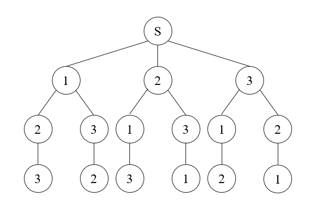

> ## [46.全排列](https://leetcode-cn.com/problems/permutations/)
&emsp;&emsp;这一题就类似于[解数独](https://leetcode-cn.com/problems/sudoku-solver/)，都是属于回溯法的范畴，想要具体了解这个方法，推荐 [扒一扒回溯算法的裤子](https://leetcode-cn.com/problems/permutations/solution/hui-su-suan-fa-xiang-jie-by-labuladong-2/)，这位大佬讲的比我好，我就直接拿来主义了，接下来有图有真相
<div align=center>

</div>

这种回溯法**个人认为**有个模板，就是**添加影响-递归-移除影响**
```C++
temp_res.push_back(temp);
cur(res, nums, temp_res);
temp_res.pop_back();
```
上文中第一行就是**添加影响**，第二行**递归**，第三行**移除影响**,这三个部分就是回溯部分的框架，其他的部分按照题目要求添加

> ## [47.全排列II](https://leetcode-cn.com/problems/permutations-ii/)
&emsp;&emsp;这题就是 [全排列](https://leetcode-cn.com/problems/permutations/)的变种，就是比全排列多了个重复的数字，并且数字重复在将数组排列过后变得尤其简单，只需要判断全排列的当前数字和其前一位是否相等就可以了，就可以完全去除重复情况

> ## [51.八皇后](https://leetcode-cn.com/problems/n-queens/)<br>[52.八皇后II](https://leetcode-cn.com/problems/n-queens-ii/)
&emsp;&emsp;经典的回溯算法例题，首先题目可能有一些误解，这里的皇后并不是像Leetcode官方介绍的那样，其实是如果在某个位置摆放了皇后，那么在该位置的同一列、同一行、主对角线方向、次对角线方向都不可以摆放皇后了，那么我们就可以按照回溯方法的思想，每一个决策层是矩阵的一行，首先判断在该位置是否可以放置皇
```C++
for (int i = 0; i < n; i++)
{
    if (is_vaild(board, row, i))
    {
        board[row][i] = 'Q';
        backtrack(res, board, row + 1);
        board[row][i] = '.';
    }
}
```
后，如果可以在该位置放置皇后，随后进入下一层即下一行的决策。
&emsp;&emsp;判断当前位置是否有效只需要判断在当前位置的"上方"相对位置是否有皇后，因为是从上而下的回溯，所以下方肯定没有皇后
```C++
for (int i = 0; i < row; i++)
    if (board[i][column] == 'Q')
        return false;
for (int i = row - 1, j = column - 1; i >= 0 && j >= 0; i--, j--)
    if (board[i][j] == 'Q')
        return false;
for (int i = row - 1, j = column + 1; i >= 0 && j < n; i--, j++)
    if (board[i][j] == 'Q')
        return false;
```