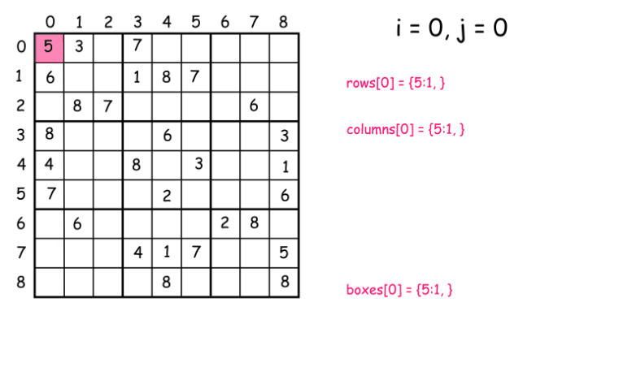
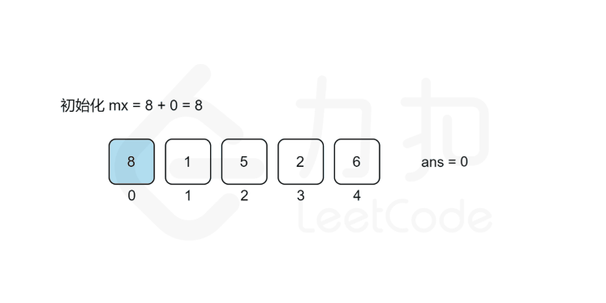

> ## [26.删除排序数组中的重复项](https://leetcode-cn.com/problems/remove-duplicates-from-sorted-array/) 
&emsp;&emsp;这题思路相当简单，但是是原地改变数组，我们如果`vector.earse()`方法会改变数组的大小迭代器用不了，那么只能将非重复的数往前‘挪’，但是为了加快程序运行速度，可以直接将采用双指针的方法，$i$、$j$两个指针，其中$i$得到的重复数组，而$j$是遍历数组的指针，碰到`nums[i]!=nums[j]`时，`i++`并`nums[i]=nums[j++]`，经过这两步就可以实现将非重复的元素移到前面，随后使用`vector.pop()`删去最后$j-i$个元素。

>  ## [27.移除元素](https://leetcode-cn.com/problems/remove-element/) 
&emsp;&emsp;思路与26大差不离，也是利用双指针，$i$、$j$两个指针，只有初始值的不同，和$i$移动的方式不同而已

> ## [28.实现 strStr()](https://leetcode-cn.com/problems/implement-strstr/)
&emsp;&emsp;在这里我是用的很暴力的算法直接比较，不一样后移，知道找到其实位置或者调出循环

> ## [31.下一个排列](https://leetcode-cn.com/problems/next-permutation/)
&emsp;&emsp;由数学性质可以得到，如果想得到当前排列的下一个序列，仅仅只需要将排名靠后"较大"的数和排名靠前的“较小”的数交换即可，但是题目要求最小，所以需要按照以下策略进行更改
* “较大”的数要尽可能的小
* 将较大的数与前面较小的数交换的时候，**必须**将从交换位置到结束排序，以保证当前序列尽可能靠近交换后的序列

> ## [转变数组后最接近目标值的数组和](https://leetcode-cn.com/problems/sum-of-mutated-array-closest-to-target/)
&emsp;&emsp;由数学性质，可以很轻松的推出，当当前数组的元素之和小于`target`时，是不需要转变数组的，即返回当前数组最大值，由于要求求和结果尽可能小并且结果可能并不是当前数组中的值，所以先对目标数组排序后，从左到右遍历(此处用**二分查找应该更快**，懒癌晚期)找到`i`使得`arr[0]+...+arr[i]>target`，则整数`value`的值就在`arr[i-1]`~`arr[i]`之间，在对这个区间进行二分查找，同时记录下$|sum-target|$，当二分查找结束后，即可得到当前`value`

> ## [33.搜索旋转排序数组](https://leetcode-cn.com/problems/search-in-rotated-sorted-array/)
&emsp;&emsp;首先探索下所谓旋转数组的性质，由于是由有序数组旋转得来，则得到的数组必定局部有序，并且对任意一个`i`，只要`nums[i]>=nums[0]`，那么由`0~i`组成的数列必定是有序的，相似的只要`nums[i]<=nums[nums.size()-1]`那么由索引`i~nums.size()-1`对应数组成的数列也必定是有序的。那么对于二分查找而言，由于只存在一个旋转点，那么数组左半部分和右半部分必定至少有一个是有序的，首先判断那一部分有序，然后调整二分查找的左半部分和右半部分，最终就可以得到`target`是否存在于当前数组，以及下标

> ## [34.在排序数组中查找元素的第一个和最后一个位置](https://leetcode-cn.com/problems/find-first-and-last-position-of-element-in-sorted-array/)
&emsp;&emsp;简单粗暴的就是遍历法，由于要求时间复杂度是$O(logN)$级别，方法肯定就是二分查找的方式
* 遍历法：这个不用多说，第一次遇见记录索引，第二次遇见记录索引，没有就`(-1,-1)`
* 二分法：思路很简单，细节是魔鬼。我在写这个代码的时候因为二分的问题进入无限递归，我们需要对二分法进行改造，使得能够找到`target`的左边界和右边界，同时设置一个标志`flag`表示当前二分查找是在寻找左边界还是右边界
    > 二分法虽然是在算法入门的时候就学习过的入门级算法，但是老司机还是很容易翻车，因为`int`型二分的问题，可能会陷入死循环，请各位读者在实际操作的时候注意边界

> ## [35.搜索插入位置](https://leetcode-cn.com/problems/search-insert-position/)
&emsp;&emsp;两种方法，一种是暴力法，第二个是二分法
* 暴力法：直接遍历找到第一个比`target`的数，并且返回他的下标就完事了
* 二分法：这一题可以仿照[34题](https://leetcode-cn.com/problems/find-first-and-last-position-of-element-in-sorted-array/),利用二分查找找到`target`的左边界，直接返回左边界就可以了
    > 二分查找小技巧：查找有序数组时，如果数组中含有重复元素，采用二分法得到的结果不尽相同，这个判断`mid`的判断顺序有关，当先判<small>$nums_{mid}\leq target$</small>，即搜索区间尽量往左靠拢，最后得到的肯定是左区间，相反<small>$nums_{mid}\geq target$</small>，即搜索区间尽可能往右靠拢，得到的就是右区间，可以作为类似题目的模板使用！

> ## [36.有效数独](https://leetcode-cn.com/problems/valid-sudoku/)
&emsp;&emsp;将9X9的数独方格，分成三种有效区域，分别是行(row)列(column)九宫格(block)，分别统计当前的区域内有无重复数字，存在重复数字，则该九宫格无效
* 行、列都很容易表示所属于的区域，九宫格可以<small>$(row/3)\times3+column/3$</small>得到所属区域

> ## [1014. 最佳观光组合](https://leetcode-cn.com/problems/best-sightseeing-pair/)
&emsp;&emsp;思路就是将公式拆开来看，<small>$A[i]+A[j]+i-j \Longleftrightarrow (A[i]+i)+(A[j]-j)$</small>，在遍历的过程中，<small>$A[j]-j$</small>是不会变的，等于说我们需要在<small>$[0,j-1]$</small>范围内找到一个最大的 <small>$A[i]+i$</small>，所以我们在遍历的过程中维护这一个 <small>$max(A[i]+i)$</small>这一结构，就可以在 <small>$O(N)$</small>复杂度计算出所谓最佳的观光组合。

> ## [37.解数独](https://leetcode-cn.com/problems/sudoku-solver/)
&emsp;&emsp;经典解数独问题，这个主要用到两个思想
* 约束的思想：即当比如我们在某一个空格填上“1”，那么我们在这个空白所处的行、列、九宫格中就不能出现第二个"1"，我们需要解决如何知道"1"是否在所属于行、列、九宫格中出现过，就需要用到标记
* 回溯：当我们发现在某一格填写"1"不能完成数独时，那么就只能返回上一个地方重新尝试其他的数字
&emsp;&emsp;依据这两种方式，我们就可以完成解数独程序 [官方题解](https://leetcode-cn.com/problems/sudoku-solver/solution/jie-shu-du-by-leetcode/)

> ## [38.外观数列](https://leetcode-cn.com/problems/count-and-say/)
&emsp;&emsp;基本思路，初始化时记录第一个数字，然后遍历该字符串，直到碰到不同的字符，将字符的数量写入外观数列中，随后写入字符，更新字符和长度，直至到字符串结尾。

