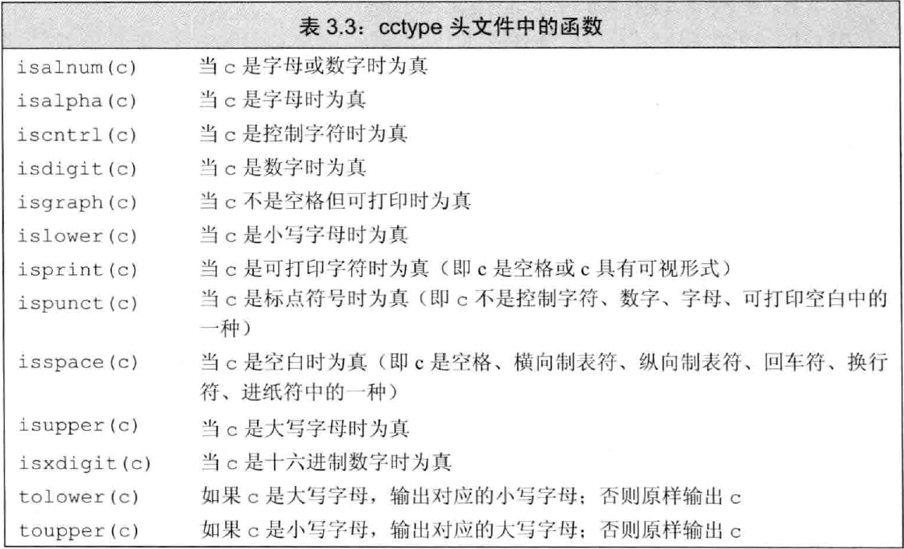
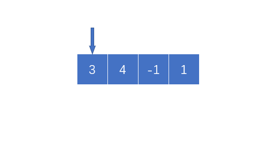

> ## [26.删除排序数组中的重复项](https://leetcode-cn.com/problems/remove-duplicates-from-sorted-array/)<br>
&emsp;&emsp;这题思路相当简单，但是是原地改变数组，我们如果`vector.earse()`方法会改变数组的大小迭代器用不了，那么只能将非重复的数往前‘挪’，但是为了加快程序运行速度，可以直接将采用双指针的方法，$i$、$j$两个指针，其中$i$得到的重复数组，而$j$是遍历数组的指针，碰到`nums[i]!=nums[j]`时，`i++`并`nums[i]=nums[j++]`，经过这两步就可以实现将非重复的元素移到前面，随后使用`vector.pop()`删去最后$j-i$个元素。

>  ## [27.移除元素](https://leetcode-cn.com/problems/remove-element/)<br>
&emsp;&emsp;思路与26大差不离，也是利用双指针，$i$、$j$两个指针，只有初始值的不同，和$i$移动的方式不同而已

> ## [28.实现 strStr()](https://leetcode-cn.com/problems/implement-strstr/)
&emsp;&emsp;在这里我是用的很暴力的算法直接比较，不一样后移，知道找到其实位置或者调出循环

> ## [31.下一个排列](https://leetcode-cn.com/problems/next-permutation/)
&emsp;&emsp;由数学性质可以得到，如果想得到当前排列的下一个序列，仅仅只需要将排名靠后"较大"的数和排名靠前的“较小”的数交换即可，但是题目要求最小，所以需要按照以下策略进行更改
* “较大”的数要尽可能的小
* 将较大的数与前面较小的数交换的时候，**必须**将从交换位置到结束排序，以保证当前序列尽可能靠近交换后的序列
<div align=center>

</div>

> ## [转变数组后最接近目标值的数组和](https://leetcode-cn.com/problems/sum-of-mutated-array-closest-to-target/)
&emsp;&emsp;由数学性质，可以很轻松的推出，当当前数组的元素之和小于`target`时，是不需要转变数组的，即返回当前数组最大值，由于要求求和结果尽可能小并且结果可能并不是当前数组中的值，所以先对目标数组排序后，从左到右遍历(此处用**二分查找应该更快**，懒癌晚期)找到`i`使得`arr[0]+...+arr[i]>target`，则整数`value`的值就在`arr[i-1]`~`arr[i]`之间，在对这个区间进行二分查找，同时记录下$|sum-target|$，当二分查找结束后，即可得到当前`value`

> ## [33.搜索旋转排序数组](https://leetcode-cn.com/problems/search-in-rotated-sorted-array/)
&emsp;&emsp;首先探索下所谓旋转数组的性质，由于是由有序数组旋转得来，则得到的数组必定局部有序，并且对任意一个`i`，只要`nums[i]>=nums[0]`，那么由`0~i`组成的数列必定是有序的，相似的只要`nums[i]<=nums[nums.size()-1]`那么由索引`i~nums.size()-1`对应数组成的数列也必定是有序的。那么对于二分查找而言，由于只存在一个旋转点，那么数组左半部分和右半部分必定至少有一个是有序的，首先判断那一部分有序，然后调整二分查找的左半部分和右半部分，最终就可以得到`target`是否存在于当前数组，以及下标

> ## [34.在排序数组中查找元素的第一个和最后一个位置](https://leetcode-cn.com/problems/find-first-and-last-position-of-element-in-sorted-array/)
&emsp;&emsp;简单粗暴的就是遍历法，由于要求时间复杂度是$O(logN)$级别，方法肯定就是二分查找的方式
* 遍历法：这个不用多说，第一次遇见记录索引，第二次遇见记录索引，没有就`(-1,-1)`
* 二分法：思路很简单，细节是魔鬼。我在写这个代码的时候因为二分的问题进入无限递归，我们需要对二分法进行改造，使得能够找到`target`的左边界和右边界，同时设置一个标志`flag`表示当前二分查找是在寻找左边界还是右边界
    
    > 二分法虽然是在算法入门的时候就学习过的入门级算法，但是老司机还是很容易翻车，因为`int`型二分的问题，可能会陷入死循环，请各位读者在实际操作的时候注意边界

> ## [35.搜索插入位置](https://leetcode-cn.com/problems/search-insert-position/)
&emsp;&emsp;两种方法，一种是暴力法，第二个是二分法
* 暴力法：直接遍历找到第一个比`target`的数，并且返回他的下标就完事了
* 二分法：这一题可以仿照[34题](https://leetcode-cn.com/problems/find-first-and-last-position-of-element-in-sorted-array/),利用二分查找找到`target`的左边界，直接返回左边界就可以了
    
    > 二分查找小技巧：查找有序数组时，如果数组中含有重复元素，采用二分法得到的结果不尽相同，这个判断`mid`的判断顺序有关，当先判<small>$nums_{mid}\leq target$</small>，即搜索区间尽量往左靠拢，最后得到的肯定是左区间，相反<small>$nums_{mid}\geq target$</small>，即搜索区间尽可能往右靠拢，得到的就是右区间，可以作为类似题目的模板使用！

> ## [36.有效数独](https://leetcode-cn.com/problems/valid-sudoku/)
&emsp;&emsp;将9X9的数独方格，分成三种有效区域，分别是行(row)列(column)九宫格(block)，分别统计当前的区域内有无重复数字，存在重复数字，则该九宫格无效
* 行、列都很容易表示所属于的区域，九宫格可以<small>$(row/3)\times3+column/3$</small>得到所属区域
<div align=center>

</div>

> ## [1014. 最佳观光组合](https://leetcode-cn.com/problems/best-sightseeing-pair/)
&emsp;&emsp;思路就是将公式拆开来看，<small>$A[i]+A[j]+i-j \Longleftrightarrow (A[i]+i)+(A[j]-j)$</small>，在遍历的过程中，<small>$A[j]-j$</small>是不会变的，等于说我们需要在<small>$[0,j-1]$</small>范围内找到一个最大的 <small>$A[i]+i$</small>，所以我们在遍历的过程中维护这一个 <small>$max(A[i]+i)$</small>这一结构，就可以在 <small>$O(N)$</small>复杂度计算出所谓最佳的观光组合。
<div align=center>

</div>

> ## [37.解数独](https://leetcode-cn.com/problems/sudoku-solver/)
&emsp;&emsp;经典解数独问题，这个主要用到两个思想
* 约束的思想：即当比如我们在某一个空格填上“1”，那么我们在这个空白所处的行、列、九宫格中就不能出现第二个"1"，我们需要解决如何知道"1"是否在所属于行、列、九宫格中出现过，就需要用到标记
* 回溯：当我们发现在某一格填写"1"不能完成数独时，那么就只能返回上一个地方重新尝试其他的数字
&emsp;&emsp;依据这两种方式，我们就可以完成解数独程序 [官方题解](https://leetcode-cn.com/problems/sudoku-solver/solution/jie-shu-du-by-leetcode/)

> ## [38.外观数列](https://leetcode-cn.com/problems/count-and-say/)
&emsp;&emsp;基本思路，初始化时记录第一个数字，然后遍历该字符串，直到碰到不同的字符，将字符的数量写入外观数列中，随后写入字符，更新字符和长度，直至到字符串结尾。
<div align=center>

</div>

> ## [39.组合总和](https://leetcode-cn.com/problems/combination-sum/)
&emsp;&emsp;为了在组合时避免去重，首先对输入数组排序。采用回溯和深度优先的思想，如下图所示，当 `target=7`，第一次选择2，问题就成了 `target=5`，一直递归下去直到 `target=0`或者不符合条件退出,图源来自于 [liweiwei1419](https://leetcode-cn.com/problems/combination-sum/solution/hui-su-suan-fa-jian-zhi-python-dai-ma-java-dai-m-2/)的[题解](https://leetcode-cn.com/problems/combination-sum/solution/hui-su-suan-fa-jian-zhi-python-dai-ma-java-dai-m-2/)
<div align=center>

</div>

> ## [40.组合总和II](https://leetcode-cn.com/problems/combination-sum-ii/)
&emsp;&emsp;与39题一脉相承的思路，但是观察例子不难发现，给出例子之中存在重复的数，并且要求的是每一个存在的数只能在一个解中出现一次，例如一共有两个数字2，那么解中最多不能出现超过两个2。还有一个是去除重复解的问题，如果继续按照 [39](https://leetcode-cn.com/problems/combination-sum/)中的思路，将会存在问题，所以采用一个 `while`循环去重 
```C++
while (i < candidates.size() - 1 && candidates[i + 1] == candidates[i])
    i++;
```
保证开头的数，每一次都不是重复的，`while`循环加上，其他的与39题没有区别

> ## [125.验证回文子串](https://leetcode-cn.com/problems/valid-palindrome/)
<div align=center>

</div>
&emsp;&emsp;这一题也没有什么好说的，前后两个指针扫描，但是有一点，我们需要忽略字母大小写、标点符号、空格等的干扰，只单单看字母和数字，这是就可以用到上述部分的函数`isalnum(c)`和 `tolower(c)`两个库函数判断当前字符是否符合要求。

> ## [67.二进制求和](https://leetcode-cn.com/problems/add-binary/)
&emsp;&emsp;开始的我陷入了一个误区就是穷举`a[i]`、`b[j]`和`temp`所有可能性，但是由于每个变量都是`0`或者`1`，所以就造成了最起码有四种情况需要考虑，分别是留1进1、留1进0、留0进1、留0进0，情况非常多写起来也很费事，但是将字符的判断转换成实际三个数相加就不需要考虑这么多种情况，于是可以利用下列代码判断进几留几
```C++
temp = (a[i] - '0') + (b[j] - '0') + temp;
res.insert(0, to_string(temp % 2));
```
&emsp;&emsp;最后处理下字符串`a`或者`b`的剩余字符，以及进位，大功告成

> ## [41.缺失的第一个正数](https://leetcode-cn.com/problems/first-missing-positive/)
&emsp;&emsp;缺失的第一个正数最好做的就是遍历找到那个最小的没有出现的正数，时间复杂度为 <small>$O(N^2)$</small>，为加快速度，可以先对整个数组排序，然后遍历找到最小的正数，时间复杂度为<small>$O(nlogn)$</small>；而题目的要求是在 <small>$O(N)$</small>时间内使用常数量级空间，可以使用原地hash，然后扫描 `nums[i]!=i+1`，返回 `i+1`
```C++
while (i + 1 != nums[i] && nums[i] > 0 && nums[i] <= nums.size() && nums[i] != nums[nums[i] - 1])
{
    temp = nums[i];
    nums[i] = nums[nums[i] - 1];
    nums[temp - 1] = temp;
}
```
&emsp;&emsp;上述代码就是进行原地hash的一个元素的过程，交换当前 `nums[i]`和 `nums[nums[i]-1]`，并且继续检查是否符合条件(我们可以很轻易分析得到第一个未出现正数的范围肯定在 <small>$[1,n+1]$</small>),原地hash完成后，扫描得到结果
<div align=center>

</div>

> ## [43. 字符串相乘](https://leetcode-cn.com/problems/multiply-strings/)
&emsp;&emsp;模拟乘法过程，依次累乘，结果加在一起的暴力算法

> ## [49. 字母异位词分组](https://leetcode-cn.com/problems/group-anagrams/) <br>
&emsp;&emsp;首先有一个思路，就是如果一个字符串是由完全相同的元素构成的（符号表，和每个符号的数量），那么对这个字符串排序，那么得到的一定是两个完全相同的字符串。随后使用`unordered_map`计算每一种字符串出现的下标，遍历完成后再次遍历，将相同字符串下的下标对应的原字符串写入结果`res`中，得到答案。

> ## [50. Pow(x, n)](https://leetcode-cn.com/problems/powx-n/)
&emsp;&emsp;最简单暴力的方式就是一个循环，累乘得出结果，但是按照规律我们可以得到次方的规律，如下面两组公式可以得出 
$$
(2^n)^2=x^{n\times2}
$$
$$
7=2^0+2^1+2^2
$$
其中 <small>$(2^1)^2=2^2$</small>，即我们在计算 <small>$2^7$</small>的过程中可以不断平方的方式计算，这样我们就可以在 <small>$\lfloor log_27 \rfloor+1$</small>个循环之中完成次方运算。

> ## [378.有序矩阵中第K小的元素](https://leetcode-cn.com/problems/kth-smallest-element-in-a-sorted-matrix/)
&emsp;&emsp;首先，最容易就是暴力法，直接将矩阵变换成一维数组排序，没有利用到矩阵的性质，随后我们注意到，矩阵的行和列都是递增的，那么我们可以将整个矩阵按行或者按列归并排序，归并到k个停止，但是这样做行或者列中的递增性质没有利用到，那么由图中可以得到，所有的 `matrix[i][j]<=mid`的集中在左
<div align=center>

</div>

角，那么我们可以从最后一行扫描，当前行小于等于`mid`那么，当前列这一行之前的所有数均小于`mid`，累加直至第一行。
```C++
while (i >= 0 && j < n)
{
    if (matrix[i][j] <= mid)
    {
        num += (i + 1);
        j++;
    }
    else
        i--;
}
```

> ## [54.螺旋矩阵](https://leetcode-cn.com/problems/spiral-matrix/)
&emsp;&emsp;按照层遍历矩阵，每一层可以分为四个部分，四个部分大小由当前限制条件约束，分别是`up`, `down`, `left`, `right`。按照层遍历矩阵直到`up==down`或者`left==right`结束,下图是遍历一层矩阵的示意图和代码
```C++
for (int j = left; j < right; j++)
    res.push_back(matrix[up][j]);
for (int j = up; j < down; j++)
    res.push_back(matrix[j][right]);
for (int j = right; j > left; j--)
    res.push_back(matrix[down][j]);
for (int j = down; j > up; j--)
    res.push_back(matrix[j][left]);
```
<div align=center>

</div>