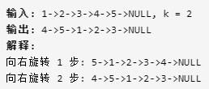

> ### [移除重复节点](https://leetcode-cn.com/problems/remove-duplicate-node-lcci/)

&emsp;&emsp;本题的思路相当简单，只需要我们在节点的过程中维护一个记录已经出现的所有元素的数据结构，为了学习C++11新的内容，我使用了`unordered_set`维护标志元素是否出现的数据结构。[成员方法参考](http://c.biancheng.net/view/7250.html)

> ## [61.旋转链表](https://leetcode-cn.com/problems/rotate-list/)
&emsp;&emsp;观察示例我们可以得到，由于是循环右移，当给定`k`满足`k%len==0`时，链表没有变化，所以只需要计算`k%len`部分即可，而由于循环右移，所以链表相对前后关系不变，所以我们需要计算左半部分和右半部分的开头和结尾即可。

&emsp;&emsp;如上`k=2`，左半部分开头为1结尾为3，右半部分的开头为4结尾为5，只需要将右半部分整体移到左半部分的左边，就完成了链表旋转。